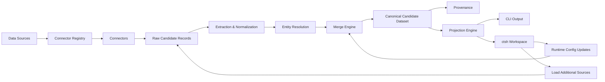

# Candidate Transformer

An enterprise-grade, production-ready Python framework for canonical candidate normalization. Candidate Transformer processes heterogeneous candidate profiles (resumes, ATS exports, recruiter spreadsheets) into a unified, highly structured canonical candidate dataset.

The framework provides an intelligent entity resolution engine, deterministic deduplication, configurable merge strategies, and an advanced projection engine to serve multiple downstream consumers from a single source of truth. It includes both a production-ready batch CLI (`candidate-transformer`) and a professional interactive REPL workspace (`ctsh`).

## Table of Contents

- [Core Features](#core-features)
- [Architecture](#architecture)
- [Project Structure](#project-structure)
- [Interactive Shell (ctsh)](#interactive-shell-ctsh)
- [Command-Line Interface (CLI)](#command-line-interface-cli)
- [Getting Started](#getting-started)
- [Input Files](#input-files)
- [Runtime Configuration](#runtime-configuration)
- [JSON Server Export](#json-server-export)
- [Outputs](#outputs)
- [Command Reference](#command-reference)

---

## Core Features

- **Data Ingestion**: Natively parses CSV, ATS JSON, and unstructured Resume text from dozens of heterogeneous sources simultaneously.
- **Canonical Candidate Model**: A strongly typed, immutable intermediate schema for all candidates.
- **Deterministic UUIDv5 IDs**: Generates stable, highly reproducible candidate IDs across pipeline runs based on intrinsic identity properties.
- **Entity Resolution**: Deterministically merges candidate profiles using strict contact and identity heuristics.
- **Field Normalization**: Automatically normalizes fields including ISO-3166 country codes, E.164 phone numbers, and lowercased emails.
- **Merge Engine**: Employs priority resolution for scalars, union merges for lists, deep dictionary merges, and deduplicates work experiences, education history, and projects.
- **Confidence Scoring**: Rigorously evaluates profile completeness and cross-source corroboration to assign confidence scores (0.0 - 1.0).
- **Provenance Tracking**: Every single merged field inherently tracks the contributing connector, merge strategy, assigned confidence, and a precise timestamp. Skill-level tracking ensures you know exactly where every skill was discovered.
- **Configurable Projections**: Schema adaptability without code changes. Serve different representations to downstream consumers dynamically.
- **Plugin Architecture**: A scalable connector registry makes adding custom connectors trivial.
- **Persistent Workspaces**: Local SQLite/JSON workspaces seamlessly preserve session states across restarts.
- **JSON Server**: Launch a detached, non-blocking background REST API directly from the REPL to serve your canonical dataset.
- **Human-readable UI**: Rich terminal table visualizations for in-depth candidate inspection.

---

## Architecture



---

## Project Structure

```text
src/
    candidate_transformer/
        api/                  # Public Facades
        cli/                  # Command definitions and shell REPL
        config/               # Pipeline configurations
        connectors/           # CSV, JSON, Text Connectors and Registry
        domain/               # Core Canonical Models
        exceptions/           # Custom error types
        export/               # JSON Server and export pipeline
        interfaces/           # Base classes and protocols
        normalizers/          # Field normalization (e.g., E.164 phones)
        pipeline/             # Resolution, Normalization, extraction stages
        projection/           # Configurable JSON Projection Engine
        strategies/           # Conflict Resolution Strategies
        utils/                # Utilities
        validation/           # Output validation
configs/                      # Configuration and projection JSONs
sample_data/                  # Example inputs
tests/                        # Test suites
```

---

## Interactive Shell (ctsh)

**ctsh (Candidate Transformer SHell)** is the interactive REPL environment bundled with Candidate Transformer. It provides a persistent workspace for loading heterogeneous candidate sources, building canonical datasets, exploring candidates, switching projections, exporting data, managing runtime configuration, and serving the transformed dataset through JSON Server.

It provides an isolated runtime environment for developers and data engineers to experiment with candidate data. With `ctsh`, you can:

- Utilize **persistent workspaces** to save, reopen, and continue previous transformation sessions seamlessly.
- Inspect candidates using beautifully formatted **Rich UI** tables or verbose **JSON output**.
- Dynamically **runtime load** additional sources and trigger a **runtime rebuild** without restarting.
- Instantly switch **projections** for varied output shapes (e.g., swapping to **analytics**).
- Manage pipeline **configuration**.
- Perform one-command HTTP **export** via JSON Server.
- Achieve a pure **no restart workflow** for enterprise data engineering.

---

## Command-Line Interface (CLI)

The batch CLI (`candidate-transformer`) is intended for automation, scripting, CI/CD pipelines, scheduled jobs, and headless execution.

It exposes core commands tailored for non-interactive pipelines:

- **`transform`**: Executes the data ingestion, canonicalization, and mapping workflow. It applies any specified **projections** or pipeline **configuration** over the provided sources.
- **`validate`**: Asserts that a generated JSON profile complies perfectly with a configuration schema.

---

## Getting Started

### Installation from GitHub (Development & Source)

```bash
git clone https://github.com/suryanandanbabbar/candidate-transformer.git
cd candidate-transformer
python -m venv venv
source venv/bin/activate
pip install -e .
```

### Quick Start

#### Input Files

Users can place their source datasets anywhere on their local filesystem and reference those absolute or relative paths directly in the CLI or `ctsh` commands. There is no rigid directory structure required for input data.

Example locations:

```text
sample_data/
├── recruiter.csv
├── ats.json
└── resume.txt
```


1. Start the interactive shell:
    ```bash
    ctsh
    ```
2. Create or open a workspace:
    ```
    ctsh> workspace new recruitment-q3
    ctsh> workspace open recruitment-q3
    ```
3. Load the three sources from `sample_data`:
    ```
    ctsh> load recruiter_csv sample_data/recruiter.csv
    ctsh> load ats_json sample_data/ats.json
    ctsh> load resume_text sample_data/resume.txt
    ```
4. Build the canonical dataset:
    ```
    ctsh> build
    ```
5. Show the first candidate:
    ```
    ctsh> show 0
    ```
6. Switch to the analytics projection:
    ```
    ctsh> project analytics
    ```

### Batch CLI Example

Run a one-shot batch transformation from the command line:

```bash
candidate-transformer transform \
  --source recruiter_csv=sample_data/recruiter.csv \
  --source ats_json=sample_data/ats.json \
  --source resume_text=sample_data/resume.txt
```

_`--source <connector>=<filepath>` defines the parser and file._

**Applying a specific projection:**

```bash
candidate-transformer transform \
  --source recruiter_csv=sample_data/recruiter.csv \
  --projection configs/projections/recruiter.json
```

_`--projection <path>` overrides the output shape without changing pipeline logic._

---

## Command Reference

### Data Ingestion

| Command                   | Description                             |
| ------------------------- | --------------------------------------- |
| `load <connector> <file>` | Load a data source through a connector. |
| `sources`                 | List loaded sources.                    |
| `connectors`              | List registered connectors.             |

### Pipeline & Projections

| Command                                      | Description                    |
| -------------------------------------------- | ------------------------------ |
| `build`                                      | Build the canonical dataset.   |
| `project <projection_name> [index] [--json]` | Run or preview a projection.   |
| `projections`                                | List available projections.    |
| `stats`                                      | Show dataset statistics.       |
| `status`                                     | Show current workspace status. |

### Candidate Inspection

| Command                                       | Description          |
| --------------------------------------------- | -------------------- |
| `show <name\|id\|index> [--verbose] [--json]` | Inspect a candidate. |

### Runtime Configuration

| Command                    | Description                          |
| -------------------------- | ------------------------------------ |
| `config show`              | Display runtime configuration.       |
| `config begin`             | Start a configuration edit session.  |
| `config set <key> <value>` | Modify a configuration value.        |
| `config apply`             | Apply pending configuration changes. |

### Persistence & Export

| Command                           | Description                         |
| --------------------------------- | ----------------------------------- |
| `save canonical <file>`           | Persist the canonical dataset.      |
| `loadcanonical <file>`            | Load a saved canonical dataset.     |
| `export <projection_name> <file>` | Export a projection to disk.        |
| `export server`                   | Launch the background JSON Server.  |
| `server status`                   | Show JSON Server status.            |
| `server restart`                  | Restart the background JSON Server. |
| `server stop`                     | Stop the background JSON Server.    |

### Workspace Management

| Command                   | Description                        |
| ------------------------- | ---------------------------------- |
| `workspace new <name>`    | Create a new workspace.            |
| `workspace open <name>`   | Open an existing workspace.        |
| `workspace list`          | List available workspaces.         |
| `workspace delete <name>` | Delete a workspace.                |
| `reset`                   | Clear the current workspace state. |

### Utility

| Command   | Description                |
| --------- | -------------------------- |
| `history` | Show command history.      |
| `clear`   | Clear the terminal screen. |
| `help`    | Display command help.      |
| `exit`    | Exit ctsh.                 |

---

## JSON Server Export

You can export the canonical dataset and launch a non-blocking, persistent REST API directly from the workspace.

```bash
ctsh> export server
```

This will automatically:

1. Export the current dataset and analytics payload.
2. Launch a fully detached background `json-server` instance.
3. Expose the data seamlessly as HTTP endpoints.

Manage the server lifecycle natively within `ctsh`:

- `server status`: View the running PID, port, and endpoint paths.
- `server stop`: Gracefully terminate the background process.
- `server restart`: Safely tear down and reboot the `json-server` instance.

_Troubleshooting: If `json-server` fails to start, ensure it is installed globally via `npm install -g json-server`._

---

## Runtime Configuration

The interactive `ctsh` workspace supports true runtime pipeline evolution.

Without restarting the application, users can:

- Modify merge priorities, projection selection, and connector behaviors.
- Edit configurations (e.g., toggling `include_confidence` or `include_provenance`) interactively.
- Rebuild the canonical dataset using the updated inputs or settings.
- Switch projections instantly to reformat data on the fly.

This mirrors enterprise data engineering workflows where datasets evolve iteratively.

---

## Outputs

Candidate Transformer generates a highly structured ecosystem of output formats optimized for different consumption patterns.

### Canonical Dataset

The definitive source of truth generated by the pipeline. Includes:

- Unified and deeply merged profiles
- Deterministic UUIDv5 IDs for stable tracing
- Intelligently normalized contacts (E.164 phones, standard emails)
- Granular, field-level provenance tracking and conflict resolution audit trails

### Built-in Projections

The canonical dataset can be dynamically shaped into distinct schemas:

- **Minimal**: Essential identity fields (Name, Contact).
- **Recruiter**: Tailored with extensive fields for recruitment evaluations.
- **ATS**: Strict schema outputs compatible with Applicant Tracking Systems.
- **Analytics**: Flattened records optimized for downstream data warehouses and BI tools.

### Interactive Outputs

Within the `ctsh` REPL, output is designed for human insight:

- **Rich Tables**: Beautifully formatted terminal UI for pipeline status and statistics.
- **JSON**: Raw, machine-readable output dumps (`--json`).
- **Verbose Inspection**: Detailed provenance table inspection with localized timestamps.
- **Statistics**: Granular metrics on pipeline performance, dataset quality, and average confidence.

### REST API Outputs

After launching `export server`, the data is served securely over HTTP:

- `GET /candidates`
- `GET /analytics`
- `GET /metadata`

### Persisted Outputs

- Exported projection JSON files
- Saved standalone Canonical Dataset snapshot binaries
- Persisted SQLite/JSON workspace states across sessions

---