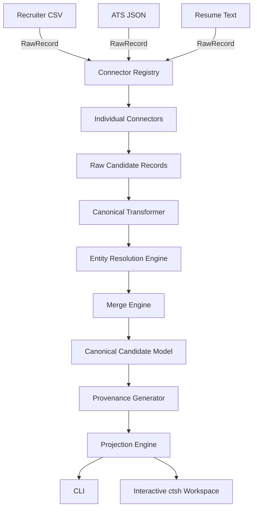

# Candidate Transformer

An enterprise-grade, production-ready Python framework for canonical candidate normalization. Candidate Transformer processes heterogeneous candidate profiles (resumes, ATS exports, recruiter spreadsheets) into a unified, highly structured canonical candidate dataset.

The framework provides an intelligent entity resolution engine, deterministic deduplication, configurable merge strategies, and an advanced projection engine to serve multiple downstream consumers from a single source of truth.

It includes both a production-ready batch CLI (`candidate-transformer`) and a professional interactive REPL workspace (`ctsh`).

## Core Features

### Data Ingestion
* **Multiple Formats**: Natively parses CSV, ATS JSON, and unstructured Resume text.
* **Simultaneous Inputs**: Ingest from dozens of heterogeneous sources at once.
* **Connector Registry**: Extensible plugin architecture makes adding custom connectors trivial.

### Canonicalization
* **Canonical Candidate Model**: A strongly typed, immutable intermediate schema for all candidates.
* **Entity Resolution**: Deterministically merges candidate profiles using strict contact and identity heuristics.
* **Field Normalization**: Automatically normalizes fields including ISO-3166 country codes, E.164 phone numbers, and lowercased emails.
* **Confidence Scoring**: Rigorously evaluates profile completeness and cross-source corroboration to assign confidence scores (0.0 - 1.0).

### Merge Engine
* **Intelligent Strategies**: Employs priority resolution for scalars, union merges for lists, and deep dictionary merges.
* **Deduplication**: Eliminates duplicate work experiences, education history, and projects deterministically.
* **Deterministic IDs**: Generates stable `UUIDv5` candidate IDs across runs based on identity properties.

### Provenance Tracking
Every single merged field automatically tracks:
* The contributing **connector**
* The **merge strategy** used
* The assigned **confidence**
* A precise **timestamp**
* *Skill-level source tracking* ensures you know exactly where every skill was discovered.

---

## Projection Engine

Projections allow multiple downstream consumers to seamlessly reuse the same canonical dataset without modifying the transformation engine. Output shapes can be dynamically altered at runtime.

Available Built-in Projections:
* **Minimal**: Outputs only essential identity fields (Name, Contact).
* **Recruiter**: Tailored with extensive fields for recruiter workflows.
* **ATS**: Outputs a schema strictly compatible with Applicant Tracking Systems.
* **Analytics**: Flattens nested data for downstream data warehouses and reporting tools.

---

## Interactive Shell (`ctsh`)

Candidate Transformer features `ctsh`, a powerful interactive REPL workspace similar to `cqlsh`, `psql`, or `mongosh`. It provides an isolated runtime environment for developers and data engineers to experiment with candidate data.

With `ctsh`, you can load sources, build canonical datasets, explore Candidates using beautifully formatted **Rich tables**, switch active projections dynamically, and manage persistent workspaces—all without restarting the application.

### Example `ctsh` Workflow

Start the interactive shell:
```bash
ctsh
```

Execute your workflow interactively:
```bash
ctsh> workspace list
ctsh> workspace new recruitment-q3
ctsh> workspace open recruitment-q3
ctsh> load recruiter_csv sample_data/recruiter.csv
ctsh> load ats_json sample_data/ats.json
ctsh> load resume_text sample_data/resume.txt
ctsh> build
ctsh> status
ctsh> show 0
ctsh> project analytics
ctsh> export analytics output.json
```

### Command Reference

**Loading**
* `load <connector> <file>`

**Pipeline**
* `build`
* `project <projection_name>`

**Inspection**
* `status`
* `stats`
* `show <name|id|index>`
* `sources`
* `projections`
* `connectors`

**Configuration**
* `config show`
* `config begin`
* `config set <key> <value>`
* `config apply`

**Persistence**
* `save canonical <file>`
* `loadcanonical <file>`
* `export <projection_name> <file>`

**Workspace**
* `workspace new <name>`
* `workspace open <name>`
* `workspace list`
* `workspace delete <name>`

**Utility**
* `help`
* `history`
* `reset`
* `clear`
* `exit`

*(Tip: You can use `--verbose` or `--json` flags with the `show` command).*

---

## Runtime Configuration

The `ctsh` shell supports powerful runtime configuration. After loading data, you can seamlessly modify the behavior of the framework without restarting:
* Switch active projections to preview different downstream outputs.
* Load additional connectors on the fly.
* Re-run transformations (`build`) to instantly see the impact of new data.
* Manage, save, and switch between persistent Workspace states (`workspace new`, `workspace open`).

This interactive tuning loop drastically reduces the iteration cycle when onboarding new heterogeneous data sources in production.

---

## Command-Line Interface (CLI)

For batch processing and CI/CD pipelines, the framework provides the non-interactive `candidate-transformer` CLI.

**Transforming multiple sources into a canonical dataset:**
```bash
candidate-transformer transform \
  --source recruiter_csv=sample_data/recruiter.csv \
  --source ats_json=sample_data/ats.json \
  --source resume_text=sample_data/resume.txt
```
*`--source <connector>=<filepath>` defines the parser and file.*

**Applying a specific projection:**
```bash
candidate-transformer transform \
  --source recruiter_csv=sample_data/recruiter.csv \
  --projection configs/projections/recruiter.json
```
*`--projection <path>` overrides the output shape without changing pipeline logic.*

---

## Architecture

The framework enforces a strict separation of concerns, decoupling raw ingestion from canonicalization and final downstream projection.



---

## Extending the Framework

Candidate Transformer is highly modular and heavily utilizes a Plugin Registry pattern. Developers can easily extend functionality by dropping new Python classes into the source tree. 

The framework automatically discovers extensions wrapped in decorators:
* **Connectors** (`@connector_registry("name")`)
* **Merge Strategies** (`@strategy_registry("name")`)

Adding a new connector simply requires inheriting from `BaseConnector` and implementing the `fetch()` iterator. Similarly, projections are purely JSON-driven, meaning you can add entirely new schemas without writing any Python code.

---

## Project Structure

```text
src/
    candidate_transformer/
        api/                  # Public Facades
        cli/                  # Command definitions and shell REPL
        config/               # Pipeline configurations
        connectors/           # CSV, JSON, Text Connectors and Registry
        domain/               # Core Canonical Models
        pipeline/             # Resolution, Normalization, extraction stages
        projection/           # Configurable JSON Projection Engine
        strategies/           # Conflict Resolution Strategies
        utils/                # Utilities
        validation/           # Output validation
configs/                      # Configuration and projection JSONs
sample_data/                  # Example inputs
tests/                        # Test suites
```

---

## Production Features

This framework is built strictly for production enterprise environments:
* **Deterministic Candidate IDs**: UUIDv5 ensures exact reproducibility.
* **Provenance Tracking**: Absolute auditability back to raw origins.
* **Confidence Scoring**: Heuristics to grade merged reliability.
* **Connector Registry**: Scalable plugin discovery.
* **Runtime Workspace**: Persisted REPL state using local `.ctsh/workspaces`.
* **Configurable Projections**: Schema adaptability without code changes.
* **Modular Architecture**: Decoupled ingestion, transformation, and presentation.

---

## Installation

Both installation methods securely provide access to the `candidate-transformer` CLI and the `ctsh` interactive shell.

**From GitHub (Development & Source)**
```bash
git clone https://github.com/example/candidate-transformer.git
cd candidate-transformer
python -m venv venv
source venv/bin/activate
pip install -e .
```

**From PyPI (Future)**
```bash
pip install candidate-transformer
```
