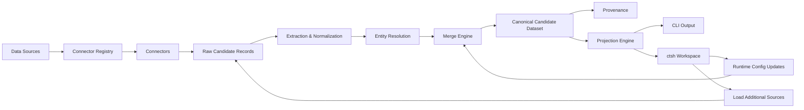

# Candidate Transformer

An enterprise-grade, production-ready Python framework for canonical candidate normalization. Candidate Transformer processes heterogeneous candidate profiles (resumes, ATS exports, recruiter spreadsheets) into a unified, highly structured canonical candidate dataset.

The framework provides an intelligent entity resolution engine, deterministic deduplication, configurable merge strategies, and an advanced projection engine to serve multiple downstream consumers from a single source of truth. At runtime, users can iteratively ingest additional data sources, modify pipeline configuration, rebuild the canonical dataset, and switch downstream projections without restarting the interactive workspace.

It includes both a production-ready batch CLI (`candidate-transformer`) and a professional interactive REPL workspace (`ctsh`).

## Core Features

### Data Ingestion
* **Multiple Formats**: Natively parses CSV, ATS JSON, and unstructured Resume text.
* **Simultaneous Inputs**: Ingest from dozens of heterogeneous sources at once.
* **Connector Registry**: Extensible plugin architecture makes adding custom connectors trivial.

### Canonicalization
* **Canonical Candidate Model**: A strongly typed, immutable intermediate schema for all candidates.
* **Entity Resolution**: Deterministically merges candidate profiles using strict contact and identity heuristics.
* **Field Normalization**: Automatically normalizes fields including ISO-3166 country codes, E.164 phone numbers, and lowercased emails.
* **Confidence Scoring**: Rigorously evaluates profile completeness and cross-source corroboration to assign confidence scores (0.0 - 1.0).

### Merge Engine
* **Intelligent Strategies**: Employs priority resolution for scalars, union merges for lists, and deep dictionary merges.
* **Deduplication**: Eliminates duplicate work experiences, education history, and projects deterministically.
* **Deterministic IDs**: Generates stable `UUIDv5` candidate IDs across runs based on identity properties.

### Provenance Tracking
Every single merged field automatically tracks:
* The contributing **connector**
* The **merge strategy** used
* The assigned **confidence**
* A precise **timestamp**
* *Skill-level source tracking* ensures you know exactly where every skill was discovered.

---

## Advanced Features (Project Twist)

Beyond the assignment requirements, Candidate Transformer introduces:

- Interactive REPL workspace (ctsh)
- Runtime ingestion of additional data sources
- Runtime configuration editing and rebuilds
- Persistent workspaces
- Rich terminal UI with tabular inspection
- JSON and human-readable inspection modes
- Dynamic projection switching
- Plugin-based connector registry

---

## Projection Engine

Projections allow multiple downstream consumers to seamlessly reuse the same canonical dataset without modifying the transformation engine. Output shapes can be dynamically altered at runtime.

Projections are applied after canonicalization. The canonical dataset remains unchanged while multiple downstream representations can be generated from the same transformed data.

Available Built-in Projections:
* **Minimal**: Outputs only essential identity fields (Name, Contact).
* **Recruiter**: Tailored with extensive fields for recruiter workflows.
* **ATS**: Outputs a schema strictly compatible with Applicant Tracking Systems.
* **Analytics**: Flattens nested data for downstream data warehouses and reporting tools.

---

## Getting Started

### Installation from GitHub (Development & Source)

```bash
git clone https://github.com/suryanandanbabbar/candidate-transformer.git
cd candidate-transformer
python -m venv venv
source venv/bin/activate
pip install -e .
```

### Preparing Input Data

Place your input files inside the `sample_data/` directory (or another directory of your choice). For example:

```
sample_data/
├── recruiter.csv
├── ats.json
└── resume.txt
```

Reference these file paths in your CLI or `ctsh` commands as needed.

### Quick Start

1. Start the interactive shell:
   ```bash
   ctsh
   ```
2. Create or open a workspace:
   ```
   ctsh> workspace new recruitment-q3
   ctsh> workspace open recruitment-q3
   ```
3. Load the three sources from `sample_data`:
   ```
   ctsh> load recruiter_csv sample_data/recruiter.csv
   ctsh> load ats_json sample_data/ats.json
   ctsh> load resume_text sample_data/resume.txt
   ```
4. Build the canonical dataset:
   ```
   ctsh> build
   ```
5. Show the first candidate:
   ```
   ctsh> show 0
   ```
6. Switch to the analytics projection:
   ```
   ctsh> project analytics
   ```

### Batch CLI

Run a one-shot batch transformation from the command line:

```bash
candidate-transformer transform \
  --source recruiter_csv=sample_data/recruiter.csv \
  --source ats_json=sample_data/ats.json \
  --source resume_text=sample_data/resume.txt
```
*`--source <connector>=<filepath>` defines the parser and file.*

**Applying a specific projection:**
```bash
candidate-transformer transform \
  --source recruiter_csv=sample_data/recruiter.csv \
  --projection configs/projections/recruiter.json
```
*`--projection <path>` overrides the output shape without changing pipeline logic.*

---

## Interactive Shell (`ctsh`)

Candidate Transformer features `ctsh`, a powerful interactive REPL workspace similar to `cqlsh`, `psql`, or `mongosh`. It provides an isolated runtime environment for developers and data engineers to experiment with candidate data.

Workspace state is persisted locally, allowing users to save, reopen, and continue previous transformation sessions.

With `ctsh`, you can load sources, build canonical datasets, explore Candidates using beautifully formatted **Rich tables**, switch active projections dynamically, and manage persistent workspaces—all without restarting the application.


### Command Reference

#### Data Ingestion
| Command | Description |
|---------|-------------|
| `load <connector> <file>` | Load a data source through a connector. |
| `sources` | List loaded sources. |
| `connectors` | List registered connectors. |

#### Pipeline & Projections
| Command | Description |
|---------|-------------|
| `build` | Build the canonical dataset. |
| `project <projection_name> [index] [--json]` | Run or preview a projection. |
| `projections` | List available projections. |
| `stats` | Show dataset statistics. |
| `status` | Show current workspace status. |

#### Candidate Inspection
| Command | Description |
|---------|-------------|
| `show <name|id|index> [--verbose] [--json]` | Inspect a candidate. |

#### Runtime Configuration
| Command | Description |
|---------|-------------|
| `config show` | Display runtime configuration. |
| `config begin` | Start a configuration edit session. |
| `config set <key> <value>` | Modify a configuration value. |
| `config apply` | Apply pending configuration changes. |

#### Persistence & Export
| Command | Description |
|---------|-------------|
| `save canonical <file>` | Persist the canonical dataset. |
| `loadcanonical <file>` | Load a saved canonical dataset. |
| `export <projection_name> <file>` | Export a projection to disk. |
| `export server` | Launch the background JSON Server. |
| `server status` | Show JSON Server status. |
| `stop server` | Stop the background JSON Server. |

#### Workspace Management
| Command | Description |
|---------|-------------|
| `workspace new <name>` | Create a new workspace. |
| `workspace open <name>` | Open an existing workspace. |
| `workspace list` | List available workspaces. |
| `workspace delete <name>` | Delete a workspace. |
| `reset` | Clear the current workspace state. |

#### Utility
| Command | Description |
|---------|-------------|
| `history` | Show command history. |
| `clear` | Clear the terminal screen. |
| `help` | Display command help. |
| `exit` | Exit ctsh. |

---

### JSON Server Export

You can export the canonical dataset and launch a persistent REST API directly from the workspace.

```bash
ctsh> export server
```

This will automatically:

1. Launch a background `json-server` instance.
2. Expose the data as HTTP endpoints:
   - `GET /candidates`
   - `GET /analytics`
   - `GET /metadata`

Manage the server lifecycle using:
* `server status`: View the running port and available endpoints.
* `stop server`: Gracefully terminate the background instance.

*Troubleshooting: If `json-server` fails to start, ensure it is installed globally via `npm install -g json-server`.*

---

## Runtime Configuration

The interactive `ctsh` workspace supports true runtime pipeline evolution.

Without restarting the application, users can:

* Load additional data sources into the current workspace.
* Modify merge priorities, projection selection, connector configuration, and rebuild the canonical dataset without restarting.
* Rebuild the canonical dataset using the updated inputs.
* Switch projections instantly for different downstream consumers.
* Save and reopen complete workspaces for future sessions.

This mirrors enterprise data engineering workflows where datasets evolve over time rather than being fully specified before execution.

---

## Command-Line Interface (CLI)

For batch processing and CI/CD pipelines, the framework provides the non-interactive `candidate-transformer` CLI.

**Transforming multiple sources into a canonical dataset:**
```bash
candidate-transformer transform \
  --source recruiter_csv=sample_data/recruiter.csv \
  --source ats_json=sample_data/ats.json \
  --source resume_text=sample_data/resume.txt
```
*`--source <connector>=<filepath>` defines the parser and file.*

**Applying a specific projection:**
```bash
candidate-transformer transform \
  --source recruiter_csv=sample_data/recruiter.csv \
  --projection configs/projections/recruiter.json
```
*`--projection <path>` overrides the output shape without changing pipeline logic.*

---

## Output

The framework can generate multiple outputs from the same canonical dataset:

* Canonical Candidate Dataset
* Minimal Projection
* Recruiter Projection
* ATS Projection
* Analytics Projection

---

## Architecture



---

## Extending the Framework

Candidate Transformer is highly modular and follows a plugin-based architecture. Developers can extend the framework by implementing new connectors or merge strategies and registering them with the plugin registry.

Adding a new connector requires inheriting from `BaseConnector` and implementing the `fetch()` iterator. Likewise, merge strategies can be registered independently, while projections remain JSON-driven so entirely new downstream schemas can be introduced without modifying the transformation pipeline.

---

## Project Structure

```text
src/
    candidate_transformer/
        api/                  # Public Facades
        cli/                  # Command definitions and shell REPL
        config/               # Pipeline configurations
        connectors/           # CSV, JSON, Text Connectors and Registry
        domain/               # Core Canonical Models
        pipeline/             # Resolution, Normalization, extraction stages
        projection/           # Configurable JSON Projection Engine
        strategies/           # Conflict Resolution Strategies
        utils/                # Utilities
        validation/           # Output validation
configs/                      # Configuration and projection JSONs
sample_data/                  # Example inputs
tests/                        # Test suites
```

---

## Production Features

* Deterministic Candidate IDs: UUIDv5 ensures exact reproducibility.
* Entity Resolution: Deterministic identity reconciliation across heterogeneous sources.
* Provenance Tracking: Absolute auditability back to raw origins.
* Runtime Workspace: Persisted REPL state using local `.ctsh/workspaces`.
* Configurable Projections: Schema adaptability without code changes.
* Connector Registry: Scalable plugin discovery.
* Confidence Scoring: Heuristics to grade merged reliability.
* Modular Architecture: Decoupled ingestion, transformation, and presentation.
* Runtime pipeline evolution without restart.
* Interactive workspace supporting iterative data ingestion.
* Human-readable Rich table visualizations for candidate inspection.
* Identical inputs always produce identical canonical outputs.

---